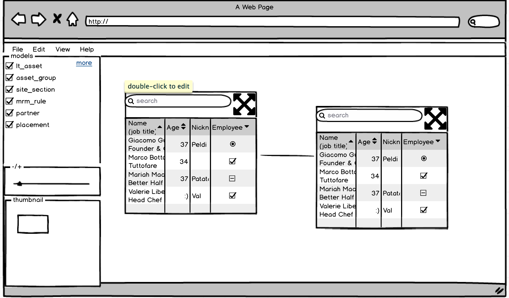

# Data Explorer

  With the arrival of age of Big Data, data is more and more complex. It is more diffcult for developers to explorer. Data Explorer is a tool for you to find your data in database conveniently and quickly. 

## term explains

* We have  two types of model. we called simple model and associative model. In general, simple model represents one table, associative model represents a table, which is bridge between two other tables.
* Relationship between model1 and model2 is unidirectional, just like foreign key in DB.

## mockups

## libraries and frameworks
* kity: https://github.com/fex-team/kity
* react: https://facebook.github.io/react/
* rails: https://github.com/rails/rails
